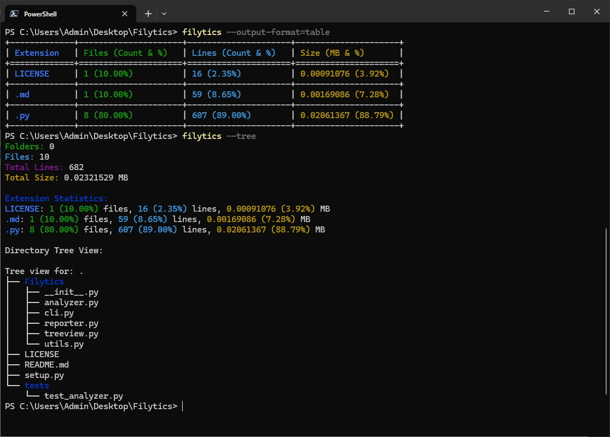

# Filytics

**Filytics** is a command-line tool for analyzing file and folder statistics. It provides detailed reports on file counts, line counts, file sizes, and extension-level insights.
<!-- get jpg from assest -->


## Features

- **Multi-Path Analysis:** Analyze multiple file and folder paths in one command.
- **Exclusion Options:** Exclude specified paths and hidden files or directories.
- **Flexible Output Formats:** Choose from text, table, JSON, CSV, or HTML reports.
- **Custom Sorting:** Sort results by file count, total lines, or size, in ascending or descending order.

## Installation

Install Filytics via pip:

```bash
pip install Filytics
```

Or install it from source:

```bash
git clone https://github.com/oaslananka/Filytics.git
cd Filytics
pip install .
```

## Usage

Run Filytics from the command line:

```bash
filytics --path /path/to/directory --exclude /path/to/exclude --output-format table --sort-by count --desc
```

### Output Formats

- `text`: Plain text output.
- `table`: A well-formatted table (requires the tabulate package).
- `json`: JSON formatted output.
- `csv`: CSV formatted output.
- `html`: HTML formatted output.

### Additional Options

- `--exclude-hidden-files`: Exclude hidden files from analysis.
- `--exclude-hidden-dirs`: Exclude hidden directories from analysis.
- `--sort-by`: Sort extensions by 'count', 'lines', or 'size'.
- `--desc`: Sort in descending order.
- `--tree`: Show a tree view of the provided path(s)

## Contributing

Contributions, bug reports, and feature suggestions are welcome! Please check our GitHub repository to open issues or submit pull requests.

## License

This project is licensed under the MIT License. See the [LICENSE](LICENSE) file for details.
